<div align="center">
  <a href="https://github.com/Arc-Jung/ezzzk/releases">
    
  </a>
</div>

# 이지직 - 치지직 개선 익스텐션 — ezzzk

> ℹ️ 이 확장은 **네이버·치지직이 만들거나 후원하지 않은 비공식 서드파티 도구**입니다.
> `치지직`·`CHZZK` 는 네이버의 상표이며, 이 프로젝트는 해당 상표와 제휴 관계가 없습니다.

치지직(chzzk.naver.com) 시청 경험을 개선하는 **Chrome / Edge 확장 프로그램**.
매 방송 진입마다 반복하는 수동 조작(화질 선택, 음소거 해제, 볼륨 맞추기, 넓은 화면 전환, 채팅창 폭 조절)을 자동화하고,
자주 쓰는 채팅과 설정 조합을 저장해 두었다가 즉시 불러 쓸 수 있게 한다.

- 지원: 데스크톱 Chrome / Edge, **Edge for Android(베타 이상)** 및 확장을 지원하는 크로미움 모바일 브라우저. **iOS 제외**
- 설계 우선순위: **모바일·태블릿 10인치급 우선**. 요구가 충돌하면 모바일·태블릿을 채택한다.
- 외부 서버 없음. 모든 설정은 `chrome.storage.local` 에만 저장하고 권한은 `storage` 하나만 쓴다.

---

## 스크린샷

> `yarn demo:shots` 로 생성한다. 경로를 손으로 적지 말고 다시 생성한다
> (`screenshots/README-snippet.md` 에 표 조각이 함께 만들어진다).
> 확장이 실제로 로드된 상태에서 **실제 방송**을 찍은 화면이다. 프리롤 광고가 끝나기를 기다린 뒤,
> 그 화면에서 보여야 할 우리 UI 가 **보이고 실제로 눌리는 상태**일 때만 저장한다
> (아니면 다른 채널로 다시 찍는다).

### 노트북 13인치 (1440×900)

| 화면 | |
|---|---|
| 기본 시청 — 채팅 부가 요소 숨김 + 컨트롤바에 `멀티`·`⚙` 버튼 삽입, 채팅 폭 조절 `↔` 토글 | 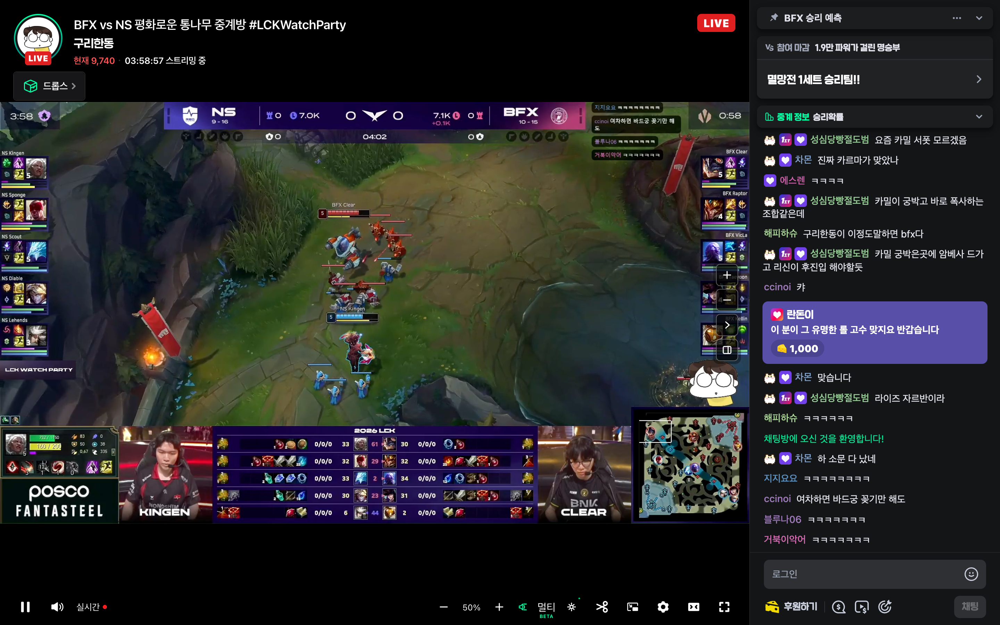 |
| 설정 패널 (FR-09.2) — 탭 7개 + 오픈소스 라이선스 고지 진입점 | 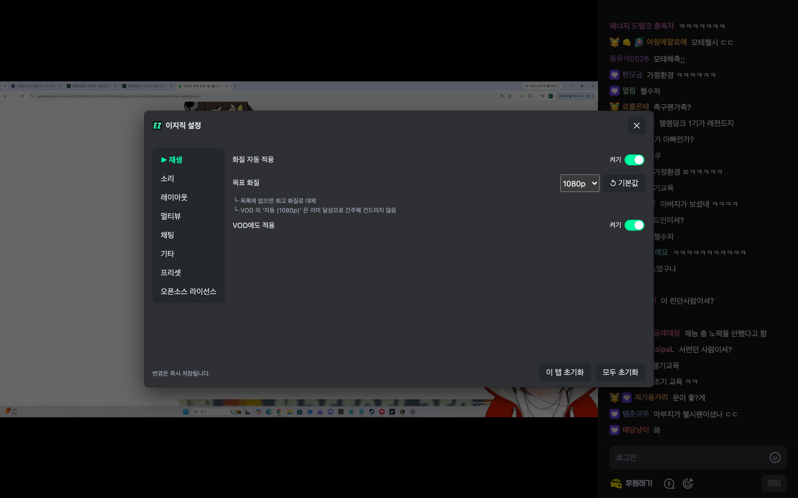 |
| 멀티뷰 구성 시트 (BETA) — 조작은 상단, 인기 방송 30개씩 추가 로드 | 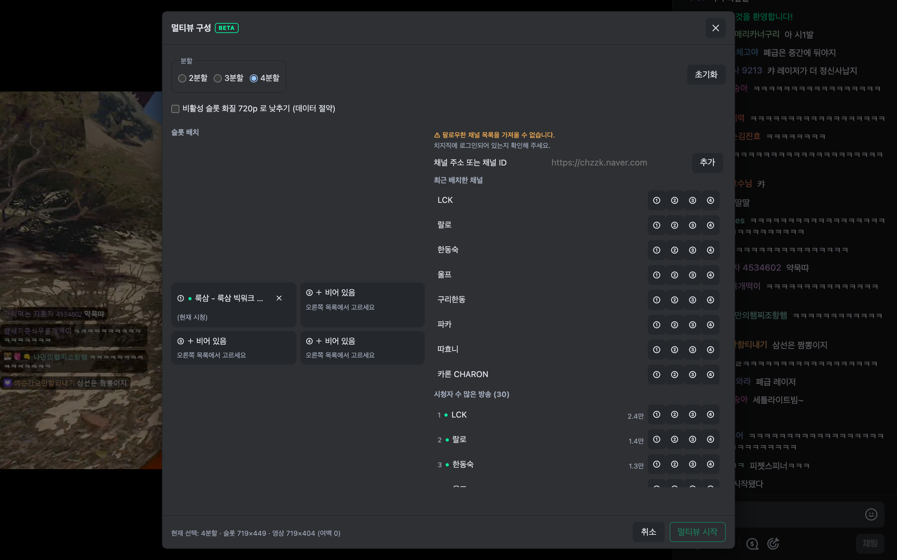 |
| 멀티뷰 시청 (BETA) — 4분할 | 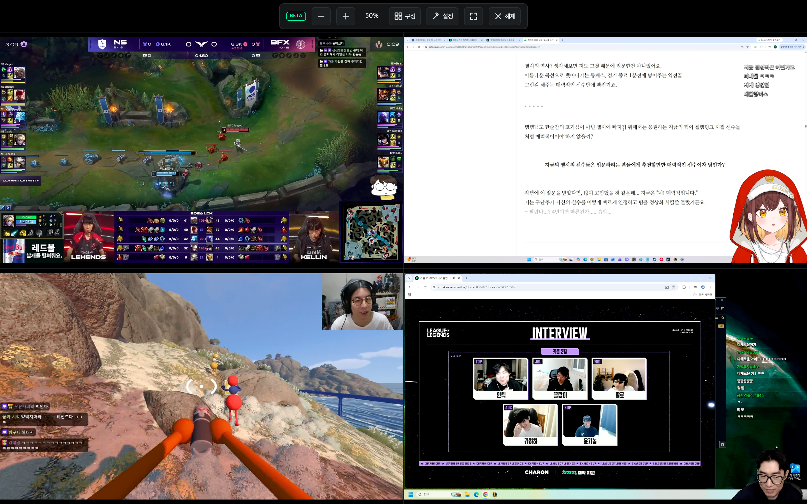 |

### 모바일 (데스크톱 사이트 요청 상태)

| 화면 | |
|---|---|
| 가로 915×412 — 기본 시청 (FR-10 초광폭 적용) | 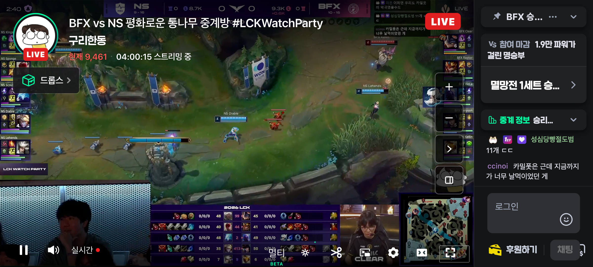 |
| 세로 412×915 — 기본 시청 (**채팅이 영상 아래로 내려간 하단 배치**) | 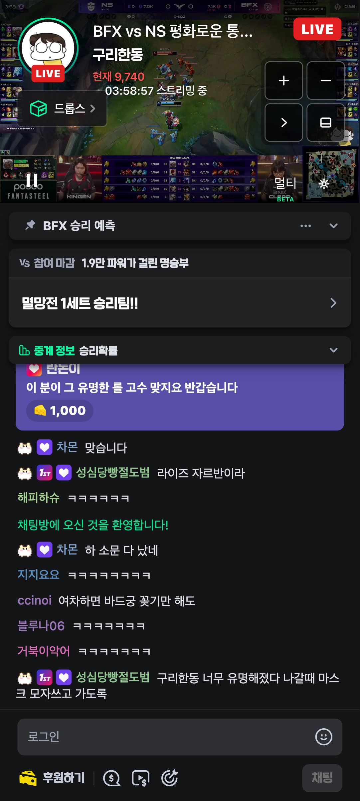 |
| 가로 915×412 — 설정 패널 | 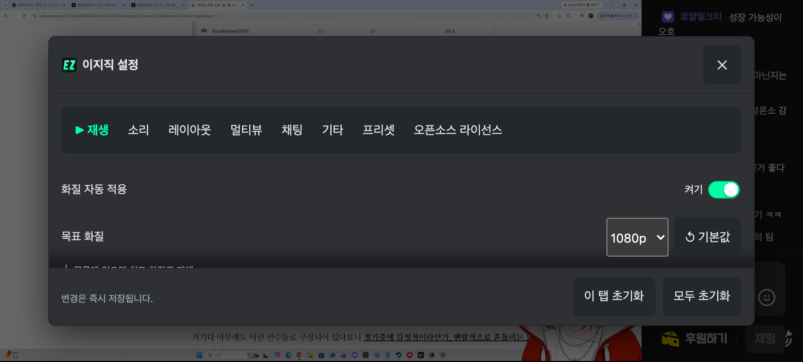 |
| 세로 412×915 — 설정 패널 | 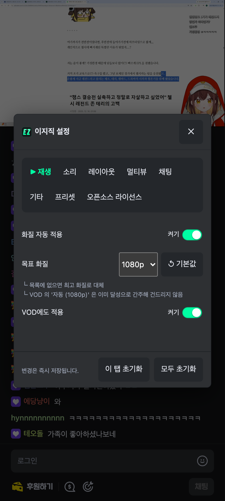 |
| 가로 915×412 — 멀티뷰 구성 (기기 상한 2분할) | 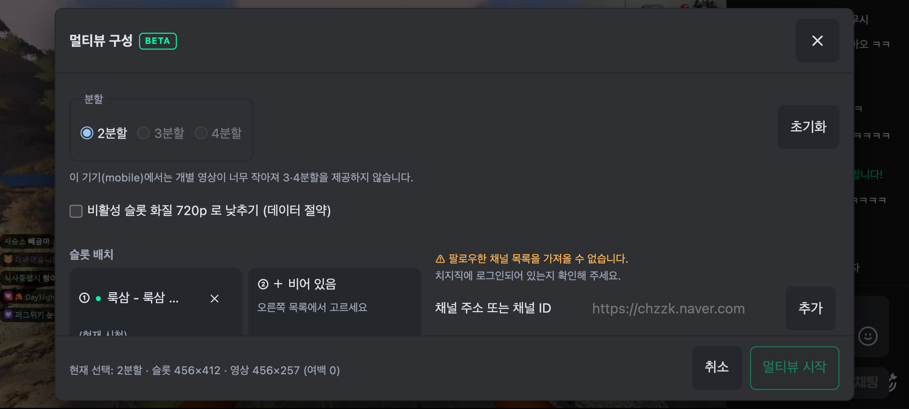 |
| 세로 412×915 — 멀티뷰 구성 (기기 상한 2분할) | 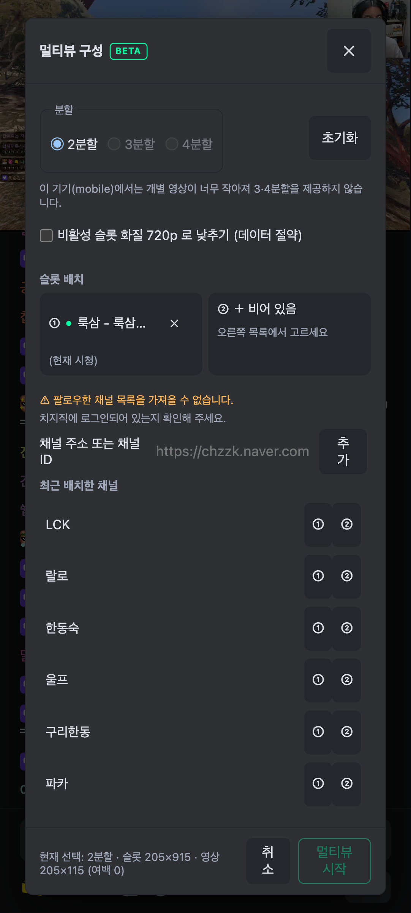 |
| 가로 915×412 — 멀티뷰 시청 (기기 상한 2분할) | 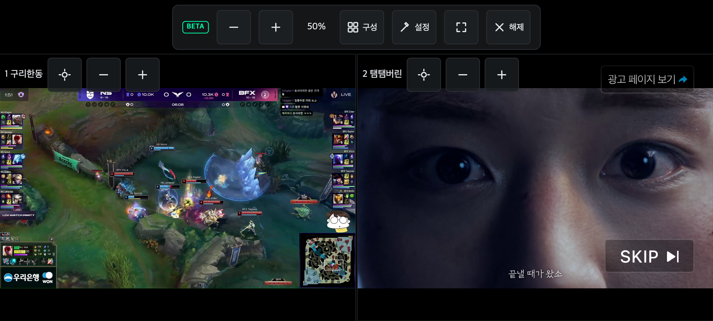 |
| 세로 412×915 — 멀티뷰 시청 (기기 상한 2분할) | 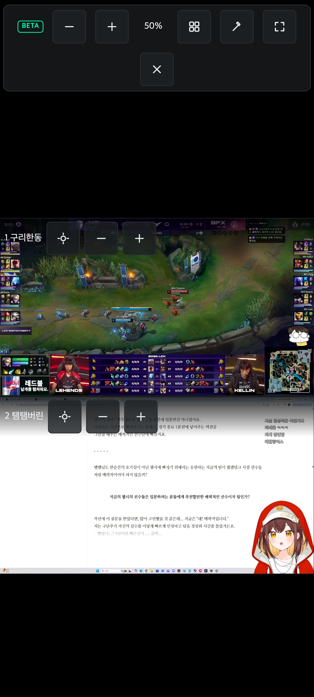 |

> ℹ️ `멀티` 버튼은 이전에 보던 구성이 있으면 그대로 이어서 연다 (구성을 바꾸려면 스테이지의 `구성`).
> **슬롯·사이드 채팅 기능은 버그로 임시 비활성**이며, 멀티뷰는 아직 **베타**다.

## 기능

| ID | 기능 | 비고 |
|---|---|---|
| FR-01 | 1080p 화질 자동 선택 | 목록에 없으면 최고 화질로 대체. VOD 도 적용 |
| FR-02 | 음소거 자동 해제 + 기본 볼륨 50% | 브라우저 자동재생 정책상 최초 클릭까지 미뤄질 수 있다 |
| FR-03 | `+` / `-` 볼륨 조절 (10% 단위) | 증감 폭 5 / 10 / 20% 선택 |
| FR-03.2 | **볼륨 100% 초과 증폭 (최대 200%)** | `video.volume` 은 0~1 이라 Web Audio 게인으로 올린다. 100% 를 넘으면 표시가 **주황색** |
| FR-19 | **음량 평탄화(오디오 컴프레서)** | **기본 켜짐.** 방송마다 다른 음량을 눌러 균일하게. 구현은 chzzk-plus(MIT) 참조 |
| FR-04 | 자주 쓰는 채팅 저장·바로 쓰기 | 최대 50개, 기본 동작은 즉시 전송. 문구 버튼은 **`후원하기` 왼쪽**에 들어간다 |
| FR-05 | 채팅창 점유율 조절 (15~50%) | 평소에는 **`↔` 토글 하나**만 `채팅` 버튼 왼쪽에 두고, 펼치면 `+ − ⟩ ▦` 가 나온다. 세로 자세에서는 채팅이 **영상 아래**로 간다 |
| FR-06 | 통나무(파워) 자동 수집 | **기본 끄기** — 아래 주의 참조 |
| FR-07 | 자동 넓은 화면 | VOD 도 적용 |
| FR-08 | 옵션 프리셋 저장·불러오기 | 최대 20개. 기본 3종(기본 · 채팅 집중 · 영상 집중) 제공 |
| FR-09 | 확장 팝업 + 페이지 내 세부 설정 패널(탭 7개) | 변경 즉시 저장, 열린 모든 탭에 반영 |
| FR-10 | 초광폭 가로 모드 (16:9 무잘림 + 잔여 폭 채팅) | 19.5:9 등 16:9 초과 비율에서 자동 적용 |
| FR-11 | 특정 유저 채팅만 표시 | 복수 선택 가능. 켜는 즉시 최근 200개에서 과거 발언 채움 |
| FR-12 | 기기 유형별 최적 UI·UX | 데스크톱 / 노트북 / 태블릿 13"·10"·7" / 모바일 6종 |
| FR-13 | 치트키 구매 팝업 가리기 | 프로모션 팝업 UI(배너 + 플레이어 툴팁)를 가린다 |
| FR-14 | 2~4 화면 분할 동시 시청(멀티뷰) | 슬롯마다 음소거·볼륨을 직접 조절한다(모든 슬롯이 소리를 낸다). 슬롯·사이드 채팅은 버그로 임시 비활성. 조작 바(`− + 50% 구성 ⛶ 해제`)는 가운데 상단, 볼륨은 마스터다 |
| FR-15 | 채팅 폰트 크기 조절 | 사이드 11~24px(기본 14) · 슬롯 10~16px(기본 12) |
| FR-16 | 채팅창 부가 요소 숨김 | `채팅` 헤더 · 주간 후원 랭킹 · 드롭스 안내. **기본 숨김**, 항목별 토글 |
| FR-17 | 채팅창 광고 배너 숨김 | **기본 숨김**. 배너 UI 만 가린다 — 영상 광고 재생에는 개입하지 않는다 |
| FR-18 | 광고 `SKIP` 버튼 자동 클릭 | **기본 켜기**. 스킵 버튼이 나타나면 대신 눌러 준다 (92초 광고에서 75.8초 절약 실측) |
| FR-18.2 | `광고 차단 프로그램을 사용 중이신가요?` 안내 자동 확인 | FR-18 과 같은 토글. 문구로만 판정하고 `자세히 보기` 링크는 누르지 않는다 |

### 페이지별 지원 범위

| 페이지 | 지원 |
|---|---|
| 데스크톱 라이브 (`chzzk.naver.com/live/…`) | 전부 |
| VOD (`chzzk.naver.com/video/…`) | 화질·볼륨·넓은 화면·설정 패널 (채팅 관련 기능은 대상이 없다) |
| 모바일 웹 (`m.chzzk.naver.com`) | **화질·볼륨만** — 이 사이트에는 채팅 UI·넓은 화면 버튼이 아예 없다. 진입 시 안내를 1회 노출한다 |

> 모바일에서 채팅과 함께 보려면 브라우저의 **"데스크톱 사이트 요청"**을 켜면 된다.
> 그 상태에서 가로로 돌리면 FR-10 이 자동 적용된다.
>
> ⚠️ **확장이 데스크톱 사이트로 자동 전환해 주지는 못한다.** 모바일 UA 로 접속하면 치지직이
> `m.chzzk` 로 다시 보내 확장이 리다이렉트하면 무한 루프가 되기 때문이다. 대신 안내를 1회 노출한다.

---

## 단축키

| 동작 | 단축키 |
|---|---|
| 볼륨 올리기 / 내리기 | `Shift + ↑` / `Shift + ↓` |
| 채팅 프리셋 1~9번 | `Alt + 1` ~ `Alt + 9` |
| 멀티뷰 열기 | `Alt + M` |
| 멀티뷰 오디오 슬롯 전환 | `Alt + Shift + 1` ~ `Alt + Shift + 4` |
| 세부 설정 패널 | `Alt + ,` |

> 치지직 네이티브 단축키 `space` · `k`(재생/일시정지) · `m`(음소거) · `f`(전체화면) 는 **쓰지 않는다.**
> 태블릿 7인치급·모바일에서는 단축키를 비활성한다.

---

## 설정

- **툴바 아이콘** — 요약·토글 중심의 팝업.
- **컨트롤바 `⚙*` 버튼** (`Alt + ,`) — 세부 설정 패널. 탭 7개: 재생 · 소리 · 레이아웃 · 멀티뷰 · 채팅 · 기타 · 프리셋.
- 변경은 **즉시 저장**된다. 저장 버튼이 없다. 열려 있는 모든 치지직 탭이 재로드 없이 따라간다.
- 항목별 기본값 되돌리기 / 탭별 초기화 / 모두 초기화(확인 1회)를 제공한다.

> ⚠️ **통나무 자동 수집은 이용약관 위반 소지가 있어 주의해야합니다.** 기본값은 끄기이며, 켜는 것은 사용자 판단이다.

---

## 개발

Node.js **24.18.0** 고정(`.nvmrc`), 패키지 매니저는 **yarn**.

```bash
nvm use            # 24.18.0
yarn install
yarn dev           # 개발 빌드 (watch)
yarn build         # 프로덕션 빌드 → dist/
yarn typecheck     # tsc --noEmit
yarn lint          # ESLint
yarn format        # Prettier 적용
yarn test          # 유닛·통합 테스트 (vitest)
```


### 수동 설치 (스토어 등록 전 · 개발자 모드)

먼저 빌드해 `dist/` 를 만든다.

```bash
nvm use && yarn install && yarn build   # → dist/
```

`dist/` 가 확장 폴더다. 이 폴더를 지우거나 옮기면 확장이 비활성되니 **고정 경로에 두는 것을 권한다.**

#### Chrome (데스크톱)

1. 주소창에 `chrome://extensions` 입력
2. 우측 상단 **개발자 모드** 켜기
3. **압축해제된 확장 프로그램을 로드** 클릭
4. `dist/` 폴더 선택
5. 툴바에 아이콘이 안 보이면 퍼즐 조각(확장) 아이콘 → `이지직` 핀 고정
6. `https://chzzk.naver.com` 열어서 확인. 컨트롤바 우측에 `⚙*` · `멀티` 버튼이 보이면 정상

#### Edge (데스크톱)

1. 주소창에 `edge://extensions` 입력
2. 좌측 하단 **개발자 모드** 켜기
3. **압축 해제된 항목 로드** 클릭
4. `dist/` 폴더 선택

#### 코드를 수정한 뒤

```bash
yarn build
```
그다음 확장 목록에서 **새로 고침(⟳)** 을 누르고, 열려 있던 치지직 탭도 새로 고친다.
`manifest.json` 을 바꿨을 때는 확장을 **제거하고 다시 로드**해야 반영되는 경우가 있다.

#### 문제가 생기면

| 증상 | 확인할 것 |
|---|---|
| 버튼이 안 보임 | 광고 재생 중에는 컨트롤바 DOM 자체가 없다. 광고가 끝난 뒤 확인 |
| 아무것도 동작하지 않음 | 확장 목록에서 **오류** 표시 확인 → `서비스 워커` 링크로 콘솔 열기 |
| 설정이 반영되지 않음 | 설정은 즉시 저장된다. 치지직 탭을 새로 고쳐 본다 |
| 자세한 로그가 필요할 때 | 설정 패널 → **기타** → `디버그 로그` 켜기 → 페이지 콘솔 확인 |

---

### 배포본으로 설치 (`.zip`)

[Releases](https://github.com/Arc-Jung/ezzzk/releases) 에서 내려받는다.
`main` 에 머지되어 CI 가 통과하면 패치 버전이 `0.0.1` 오르고 태그·릴리스가 자동으로 만들어진다.

> ⭐ **`.zip` 설치를 권장한다.** 릴리스에는 `.crx` 도 함께 올라가지만, 크롬·엣지는 보안 정책상
> 스토어 밖에서 배포된 `.crx` 설치를 차단하는 경우가 많다 — `.zip` 은 이 차단이 없다.

#### 데스크톱 설치 절차 — macOS · Windows × Chrome · Edge

**1단계 — 내려받기**

[Releases](https://github.com/Arc-Jung/ezzzk/releases) 에서 최신 버전의 `ezzzk-<version>.zip` 을 내려받는다.

**2단계 — 압축해제 후 로드 (Chrome · Edge 공통)**

| 단계 | Chrome | Edge |
|---|---|---|
| 1 | 주소창에 `chrome://extensions` | `edge://extensions` |
| 2 | 우측 상단 **개발자 모드** 켜기 | 좌측 하단 **개발자 모드** 켜기 |
| 3 | **압축해제된 확장 프로그램을 로드** | **압축을 풀린 항목 로드**(Load unpacked) |
| 4 | 압축을 푼 폴더 선택 (`manifest.json` 이 **바로 안에** 있는 폴더) | 동일 |
| 5 | `https://chzzk.naver.com` 접속 | 동일 |

압축 해제 위치는 아무 곳이나 되지만, **폴더를 지우거나 옮기면 확장이 비활성화**된다.
지워지지 않는 경로에 두는 것을 권한다.

**설치 후 확인**

- 확장 목록에 **이지직** 와 버전이 보인다
- 치지직 라이브 페이지에서 컨트롤바 우측에 `멀티` · `⚙*` 버튼이 보인다

**업데이트**

스토어 밖 설치는 자동 업데이트가 되지 않는다. 새 버전이 나오면 같은 절차를 다시 한다
(`.zip` 경로는 **같은 폴더에 덮어쓰고** 확장 관리 페이지에서 **새로 고침** 버튼을 누르면 된다).

**제거**

확장 관리 페이지에서 **삭제**. `.zip` 으로 설치했다면 압축을 푼 폴더도 함께 지운다.

직접 패키징하려면:

```bash
yarn build && yarn pack:crx      # → release/ezzzk-<version>.crx, .zip
```

---

### 수동 설치 — Edge for Android (모바일)

**전제**
- **Edge for Android 의 Dev 또는 Canary 채널**이 필요하다. 정식(Stable) 채널은 확장을 지원하지 않는다.
- iOS 는 크롬·엣지 모두 확장을 지원하지 않아 **대상이 아니다.**

**절차**

1. Play 스토어에서 **Microsoft Edge Dev** 설치
   - Edge Dev: https://play.google.com/store/apps/details?id=com.microsoft.emmx.dev
   - Edge Canary: https://play.google.com/store/apps/details?id=com.microsoft.emmx.canary
2. **기기에서 바로** [최신 릴리스](https://github.com/Arc-Jung/ezzzk/releases/latest) 를 열어
   `ezzzk-<version>.zip` 을 받는다. 이 zip 이 곧 빌드 산출물이라 **직접 빌드할 필요가 없다.**
   - 안드로이드 Edge 로 위 링크를 열고 자산을 탭하면 `Download/` 에 저장된다
   - PC 에서 받아 옮기려면 USB 파일 전송·클라우드 드라이브, 또는
     ```bash
     adb push ~/Downloads/ezzzk-*.zip /sdcard/Download/
     ```
3. Edge 에서 `⋯` 메뉴 → **설정** → **정보**(About) 에서 빌드 번호를 여러 번 탭해
   **개발자 옵션**을 활성화한다 (안드로이드 개발자 모드와 같은 방식)
4. `⋯` 메뉴 → **확장** → **개발자 모드** 켜기 →
   **압축 파일에서 설치**(또는 `Install from folder` / `Load unpacked`) 선택
5. `Download/ezzzk-<version>.zip` (또는 압축을 푼 폴더) 선택
6. `https://chzzk.naver.com` 접속

**모바일에서 반드시 함께 할 설정**

- ⭐ **"데스크톱 사이트 요청"을 켠다.** 켜지 않으면 `m.chzzk.naver.com` 으로 리다이렉트되는데,
  그 사이트에는 **채팅 UI·넓은 화면 버튼이 아예 없어** 화질·볼륨만 동작한다.
  켜고 가로로 돌리면 FR-10 초광폭 레이아웃이 자동 적용된다.
- 태블릿도 마찬가지로 켜야 한다 (태블릿 UA 도 `m.chzzk` 로 리다이렉트된다).

**모바일 제약**

| 항목 | 내용 |
|---|---|
| 단축키 | 모바일·7인치급 태블릿에서는 비활성 (물리 키보드 가정 없음) |
| 터치 타겟 | 44×44px 로 자동 확대 |
| 창 크기 | 주소창 접힘·분할 화면·회전·IME 로 수시 변한다. 레이아웃은 변화마다 재계산된다 |
| 멀티뷰 | 최대 2분할 (개별 영상이 가독 한계 이하가 되지 않도록) |

---

### 구조

```
src/
├─ content.tsx          # 기능 초기화 오케스트레이션
├─ earlyStyle.ts        # document_start 조기 스타일 (레이아웃 깜빡임 방지)
├─ background.ts        # 서비스 워커
├─ pageType.ts          # 라이브 / VOD / 모바일웹 판별
├─ device.ts            # 기기 유형 판별 + CSS 변수 주입
├─ storage.ts           # chrome.storage.local 레이어
├─ layoutArbiter.ts     # 폭 결정 단일 조정자 (멀티뷰 > FR-10 > FR-05)
├─ features/            # 기능 1개 = 파일 1개
├─ settingsPanel/       # FR-09.2 세부 설정 패널
├─ popup/               # FR-09.1 확장 팝업
├─ ui/                  # 시트 공용 컴포넌트
├─ constants/           # 셀렉터·스토리지 키·기기 프리셋 (실측일 주석 필수)
└─ utils/               # dom / log / observe / viewport / reactFiber
```

### 테스트 방침

**테스트 코드와 Playwright 실브라우저 조작을 함께** 한다. 한쪽만으로는 완료가 아니다.

- 테스트 코드: 계산식·클램프·판정 함수·스토리지 스키마 등 순수 로직
- Playwright: 실제 치지직 DOM 결합 — 좌표·렌더 결과·클릭 후 상태

필수 검증 프로필 3종 (순서는 모바일 우선): 모바일 412×915 / 915×412 · 태블릿 10인치 820×1180 / 1180×820 · 노트북 13인치 1440×900.
뷰포트만 바꾸면 안 되고 `userAgent`·`isMobile`·`hasTouch`·`deviceScaleFactor` 를 함께 설정해야 한다.
영상 크기 판정은 `video` 요소 rect 가 아니라 `pictureW = min(w, h×16/9)` 로 한다.

---

## 주의사항 · 알려진 제약

- 치지직은 예고 없이 배포되며 **CSS 모듈 해시 클래스가 빌드마다 바뀐다.** 셀렉터는 접두어 부분 일치로만 쓰고 `src/constants/class.ts` 에 모아 둔다. 셀렉터가 깨지면 해당 기능만 조용히 비활성되고 나머지는 계속 동작한다.
- 브라우저 자동재생 정책상 사용자 제스처 없이 음소거를 해제하면 재생이 멈출 수 있다. 최초 상호작용 시점에 1회 재시도하고, 그래도 실패하면 조용히 포기한다.
- 통나무 수집이 쓰는 API 는 비공개 내부 API 라 예고 없이 바뀔 수 있다. 실패를 정상 흐름으로 취급한다.
- 멀티뷰는 치지직이 iframe 임베드를 허용하는 것에 의존한다(현재 차단 헤더 없음). 차단되면 멀티뷰만 안내와 함께 비활성되고 다른 기능은 계속 동작한다.
- 안드로이드는 주소창·분할 화면·자유 창·폴더블·IME 로 창 크기가 수시로 변한다. 모든 레이아웃 값은 변화 시점에 재계산하고 캐시하지 않는다.

---

## 라이선스

이 프로젝트는 **MIT 라이선스**를 따른다. 전문은 [`LICENSE`](LICENSE) 참조.

```
MIT License · Copyright (c) 2026 Arc-Jung
```

### 고지

치지직(CHZZK)은 네이버의 서비스이며 본 프로젝트는 네이버와 **무관한 비공식 확장**이다.
치지직 상표·로고에 대한 권리는 네이버에 있다.

---

## 변경 이력

### 2026-08-23

- **멀티뷰 슬롯 자동 화질 변경이 먹통이던 문제 수정** — 설정 메뉴를 열어야 하는 경로에서 재시도가 전혀 없었고, 목표 항목을 찾고도 합성 클릭이 반영되지 않았음(키보드 Enter 활성화로 교체)
- **멀티뷰 슬롯 자동 음소거 해제가 먹통이던 문제 수정** — 2026-08-20 정책 변경 때 등록 시 자동 해제 지시가 함께 사라져, 자동재생 정책으로 음소거된 슬롯을 아무도 풀어주지 않았음(등록 시 1회 해제 복원)
- **멀티뷰 중에도 확장 설정에 접근 가능** — 스테이지가 화면 전체를 덮어 호스트 설정(⚙) 버튼이 가려지던 문제. 스테이지 조작 바에 전용 설정 버튼(망치 아이콘 — 치지직 순정 톱니 아이콘과 구분) 추가
- **멀티뷰 채널 목록에서 오프라인인 팔로우 채널은 숨김** — 지금 방송 중인 채널만 골라야 빈 슬롯이 안 생긴다
- **인기 방송 "더 보기" 1회당 10개 → 30개**로 확대
- **멀티뷰 구성 변경 후 자동재생이 안 될 수 있는 문제에 안전망 추가** — 슬롯 언마요트 직후 일시정지 상태면 재생을 한 번 더 시도(실브라우저 재현은 못했으나 예방 차원)
- 초광폭 화면(비율 1.8 이상 — 21:9·32:9 데스크톱 모니터부터 맥시마이즈한 노트북·태블릿 가로까지 모두 해당)에서 영상을 왼쪽/가운데 중 선택하는 옵션 추가(전체화면 여부와 무관하게 적용)
- 초점 슬롯의 초록 테두리 강조 표시 제거(버튼 상태 자체는 유지)
- 음량 평탄화(컴프레서) 아이콘이 허공에 뜬 선처럼 보이던 문제 수정
- 멀티뷰 구성 시트에서 슬롯 배치가 짧을 때 아래에 남던 빈 공간을 세로 가운데 정렬로 정리
- 저장된 조합이 없거나 꽉 찼을 때 비활성화되는 "현재 구성 저장" 버튼에 이유를 안내하는 title 추가
- README 정리 — 불필요한 서술 제거, 오래된 내용(초록 테두리 등) 갱신, 오디오 컴프레서 기본값 표기 수정("기본 꺼짐" → 실제 기본값인 "기본 켜짐"), 변경 이력 포맷 정리

### 2026-08-22

- 데모 스크린샷 갱신, 광고 차단 안내 재시도 로직 정리
- **멀티뷰 사이드/슬롯 채팅 기능 임시 비활성화** — 버그 다수 발견, 재작업 예정. 설정에서 선택할 수 없고 저장값과 무관하게 표시되지 않는다
- 멀티뷰 진입 클릭을 원본 재생 조작으로 오인해 원본 소리가 겹치던 문제 수정
- 초점 슬롯에 초록 테두리 표시 복원(초점 버튼이 먹통으로 보이던 문제)
- 모바일 세로 2분할에서 슬롯 높이의 약 45%가 검은 여백이던 레이아웃 수정

### 2026-08-21

- 볼륨 컨트롤에 라우드니스 컴프레서 토글 추가
- 채팅 폭 조절·프리셋 UI를 플레이어 우측 중앙으로 재배치
- 멀티뷰 오디오 라우팅 제거
- 남은 텍스트/글리프 아이콘을 공용 SVG로 교체
- 라이선스 고지를 설정 탭으로 이동, 팝업 스크롤·접근성 보강

### 2026-08-20

- ezzzk 최초 공개 릴리스 (기본 시청 화면 정리, 설정 패널, 멀티뷰 베타, 클린봇 기본 해제 등)
